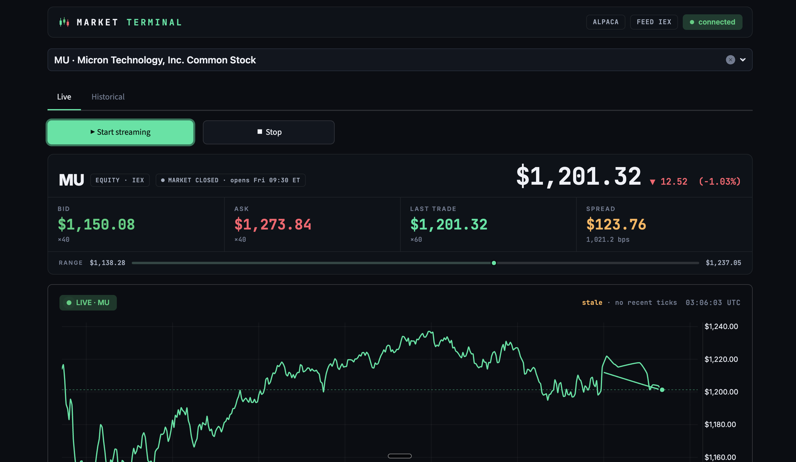
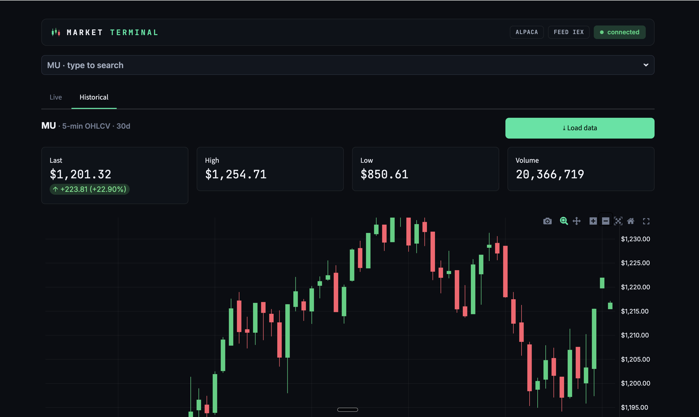

# ⚡ Mini Market Data Terminal

A compact trading-terminal clone built on **Alpaca's Market Data API**. It
authenticates to Alpaca's *paper* environment, downloads historical OHLCV data,
streams **real-time bid/ask quotes** over WebSocket, and shows it all in a
polished Streamlit UI with a type-ahead ticker search — for both **stocks and
crypto**.




---

## Features

| | |
|---|---|
| 🔐 **Secure auth** | API keys load from a git-ignored `.env`, never hard-coded |
| 📈 **Historical data** | ≥30 days of 1- or 5-minute OHLCV bars (REST) |
| 📊 **Candlestick chart** | Dark Plotly candles + volume panel |
| ⚡ **Real-time stream** | Live bid/ask/last over WebSocket, ~1s auto-refresh |
| 🟢 **Streaming chart** | Live price line (seeded from intraday bars) + bid/ask band, extends tick-by-tick |
| ⚡ **Live tape** | Price-tick flash, session-range bar, tick-latency, market-open/closed badge |
| 🎨 **Dark / Light** | Full theme toggle — sidebar, search, panels and charts all re-themed |
| 🔎 **Type-ahead search** | Autocomplete across Alpaca's full asset universe |
| 🔗 **Deep links** | `/?sym=BTC%2FUSD` opens straight into an instrument |
| 🪙 **Stocks & crypto** | `AAPL`/`TSLA` (market hours) or `BTC/USD` (live 24/7) |
| 🧪 **Connection test** | `test_connection.py` verifies keys + data + live ticks |

---

## Project structure

```
alpaca-market-terminal/
├── app.py                  # Streamlit UI (live + historical tabs)
├── test_connection.py      # one-command smoke test of your setup
├── requirements.txt
├── .env.example            # copy to .env and add your keys
├── .gitignore              # ignores .env, caches, screenshots scratch
├── .streamlit/
│   └── config.toml         # dark theme
├── screenshots/
│   └── ui.png              # ← add your UI screenshot here
└── src/
    ├── __init__.py
    ├── config.py           # loads API keys from environment
    ├── data_connector.py   # Alpaca historical + live data connector
    ├── symbols.py          # ticker universe + autocomplete search
    └── historical_viewer.py# standalone matplotlib OHLCV chart (CLI)
```

---

## Setup

### 1. Install dependencies
```bash
pip install -r requirements.txt
```

### 2. Get Alpaca paper-trading keys
Sign up (email only) at <https://app.alpaca.markets>, switch to the **Paper**
environment, and generate keys under **API Keys**. Paper keys usually start with
`PK`. Paper-only accounts get the free **IEX** data feed.

### 3. Add your keys
```bash
cp .env.example .env
```
Edit `.env`:
```
ALPACA_API_KEY=PK...your_key_id...
ALPACA_SECRET_KEY=...your_secret...
ALPACA_DATA_FEED=iex
```

### 4. Verify the connection
```bash
python test_connection.py                 # checks AAPL + BTC/USD
python test_connection.py --symbol BTC/USD --live 12   # prove live ticks
```

### 5. Launch the terminal
```bash
streamlit run app.py
```
Opens at <http://localhost:8501>.

---

## Using the app

- **🔎 Search a ticker** — start typing in the sidebar (`AAP` → `AAPL`,
  `BTC` → `BTC/USD`); it matches by symbol *and* company name.
- **⚡ Live Quotes tab** — click **Start streaming** to watch bid/ask/last/spread
  update in real time. Off-hours? Use **`BTC/USD`** for 24/7 ticks.
- **📊 Historical tab** — click **Load historical data** for a candlestick +
  volume chart and an OHLCV table.

### Standalone chart (no UI)
```bash
python -m src.historical_viewer AAPL --days 30 --minutes 5
python -m src.historical_viewer BTC/USD --save screenshots/btc.png
```

---

## How it works

- **Authentication** (`src/config.py`) — reads `ALPACA_API_KEY` /
  `ALPACA_SECRET_KEY` via `python-dotenv`; raises a clear error if missing.
- **Historical** (`AlpacaConnector.get_historical_bars`) — routes stock vs.
  crypto to the right Alpaca REST client and returns a tidy OHLCV DataFrame.
- **Live** (`AlpacaConnector.start_stream`) — runs a `StockDataStream` /
  `CryptoDataStream` on a daemon thread; quote/trade callbacks write into a
  thread-safe `LiveQuoteStore`, and the Streamlit fragment polls it once a second.
- **Autocomplete** (`src/symbols.py`) — merges a curated popular list with
  Alpaca's full tradable-asset universe (cached) for the search box.

---

## Notes & limitations

- **Paper-only accounts use the IEX feed.** Outside US market hours, stock
  quotes can be thin/stale (e.g. a `$0.01` bid); the app primes the panel with a
  REST snapshot so you still see the latest values. For a clean demo, stream a
  crypto symbol.
- **One symbol streams at a time** — starting a new ticker stops the previous
  stream.
- Paper trading does **not** simulate dividends, fees, slippage, or market impact.

---

## Rubric mapping

| Requirement | Where |
|---|---|
| Alpaca auth + key handling | `src/config.py`, `.env.example`, `.gitignore` |
| Historical data retrieval | `AlpacaConnector.get_historical_bars` |
| Historical chart | `app.py` (Plotly) + `src/historical_viewer.py` (matplotlib) |
| Real-time quote streaming | `AlpacaConnector.start_stream` + `LiveQuoteStore` |
| UI: bid/ask + auto-update | `app.py` Live Quotes tab (`st.fragment(run_every="1s")`) |
| Code organization | `src/` modules + `app.py` |
| Repo completeness | README, code, `requirements.txt`, screenshot |

---

## Demo video

A 2–5 minute walkthrough showing the UI running, historical data loading, and
live quotes updating.

[](https://youtu.be/eeIwB35b42s)

## Tech stack

`alpaca-py` · `streamlit` · `streamlit-searchbox` · `plotly` · `pandas` ·
`matplotlib` · `python-dotenv`
